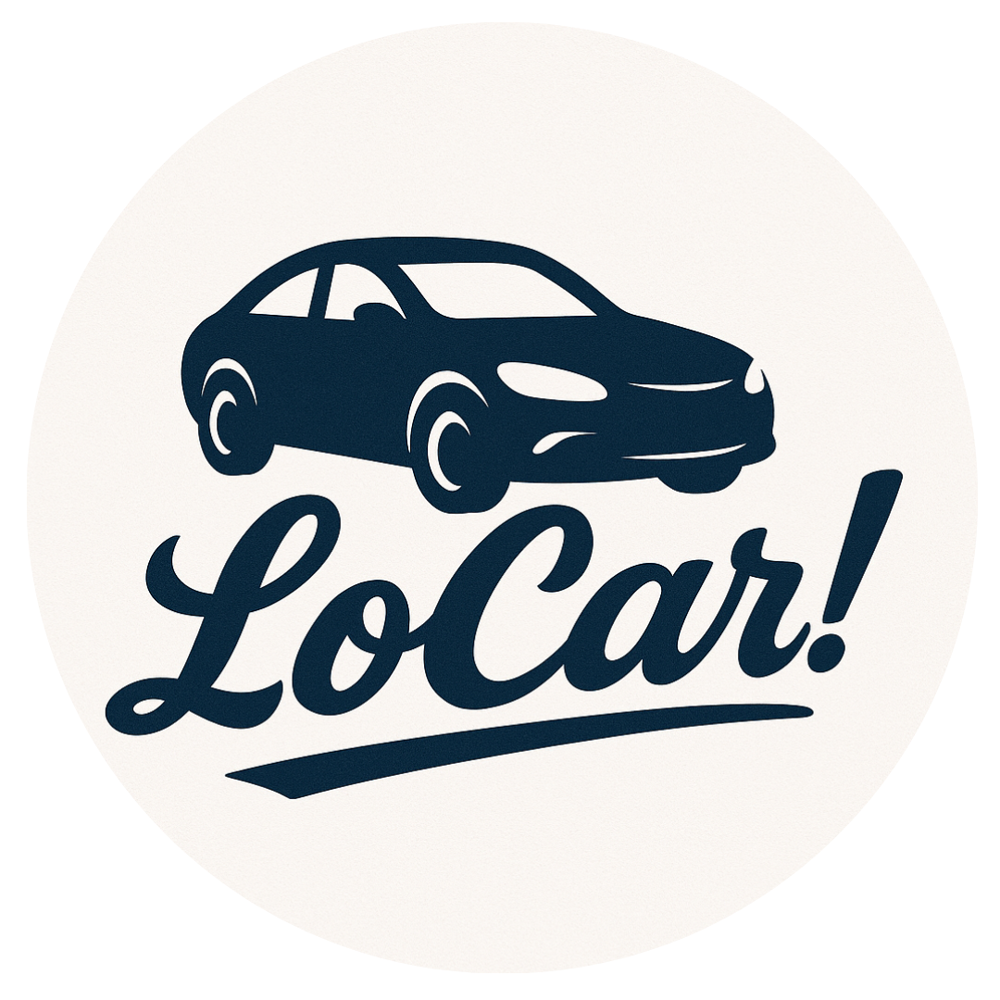

# LoCar!: Sistema de Locação de Veículos



## 📝 Descrição
O LoCar! é um sistema de gerenciamento de locação de veículos desenvolvido em Java. O sistema permite o gerenciamento de diferentes tipos de veículos (carros, motos e caminhões), clientes, funcionários e locações.

## 🚗 Funcionalidades

### Veículos
- Cadastro e gerenciamento de diferentes tipos de veículos:
  - Carros
  - Motos
  - Caminhões
- Registro detalhado das características de cada veículo
- Controle de disponibilidade
- Cálculo automático de valores de locação

### Clientes e Funcionários
- Cadastro completo de clientes
- Gerenciamento de funcionários
- Sistema de endereçamento
- Validação de dados cadastrais

### Locações
- Registro de locações
- Cálculo automático de multas por atraso
- Controle de datas de retirada e devolução
- Cálculo de valores totais

## 🛠️ Tecnologias Utilizadas
- Java 17
- Orientação a Objetos
- Manipulação de arquivos
- Enums para tipos específicos
- Tratamento de exceções

## 📁 Estrutura do Projeto
```
lo-car/ 
├── src/  
│ ├── entities/ 
│ │ ├── enums/ 
│ │ ├── Caminhao.java 
│ │ ├── Carro.java 
│ │ ├── Cliente.java 
│ │ ├── Endereco.java 
│ │ ├── Funcionario.java 
│ │ ├── Locacao.java 
│ │ ├── Moto.java 
│ │ ├── Pessoa.java 
│ │ └── Veiculo.java 
│ └── Main.java 
└── dump/ 
└── carros.txt
``` 

## 💻 Como Usar

### Pré-requisitos
- Java JDK 17 ou superior
- IDE Java (recomendado: IntelliJ IDEA)

### Instalação
1. Clone o repositório:
```
bash git clone [https://github.com/carlosmorais01/lo-car.git](https://github.com/carlosmorais01/lo-car.git)
``` 

2. Abra o projeto em sua IDE

3. Configure o JDK 17

4. Execute a classe Main.java

## 📄 Formato do Arquivo de Dados
Os veículos são armazenados no arquivo `dump/carros.txt` no seguinte formato:
```
descricao#placa#marca#nome#modelo#ano#cor#funcao#quilometragem#numeroPassageiros#consumo#velocidadeMax#automatico#combustivel#tracao#assentos#airBag#caminhoFoto#potencia#vidroEletrico#arCondicionado#multimidia#usb#vidroFume#peso#engate#direcaoHidraulica#valorDiario#portas#aerofolio
```

## ✒️ Autores
- Carlos Henrique - Desenvolvedor Backend
- José Borges - Desenvolvedor Front (Swing)
- Vinícius Espíndola - Desenvolvedor Backend

## 📬 Contato
- Email: carlos.morais@discente.ufg.br
- LinkedIn: [Carlos Henrique](https://www.linkedin.com/in/carlos-henrique-alves-morais-74040527b/)


- Email: jose_borges@discente.ufg.br
- LinkedIn: [José Borges da Cruz](https://www.linkedin.com/in/www.linkedin.com/in/josé-borges-da-cruz-3a7284369/)


- Email: viniciusespindola@discente.ufg.br
- LinkedIn: [Vinícius](www.linkedin.com/in/viniciusespindola1011)

---
⌨️ com ❤️ por Carlin, Zézin e Vinic1n